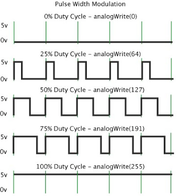
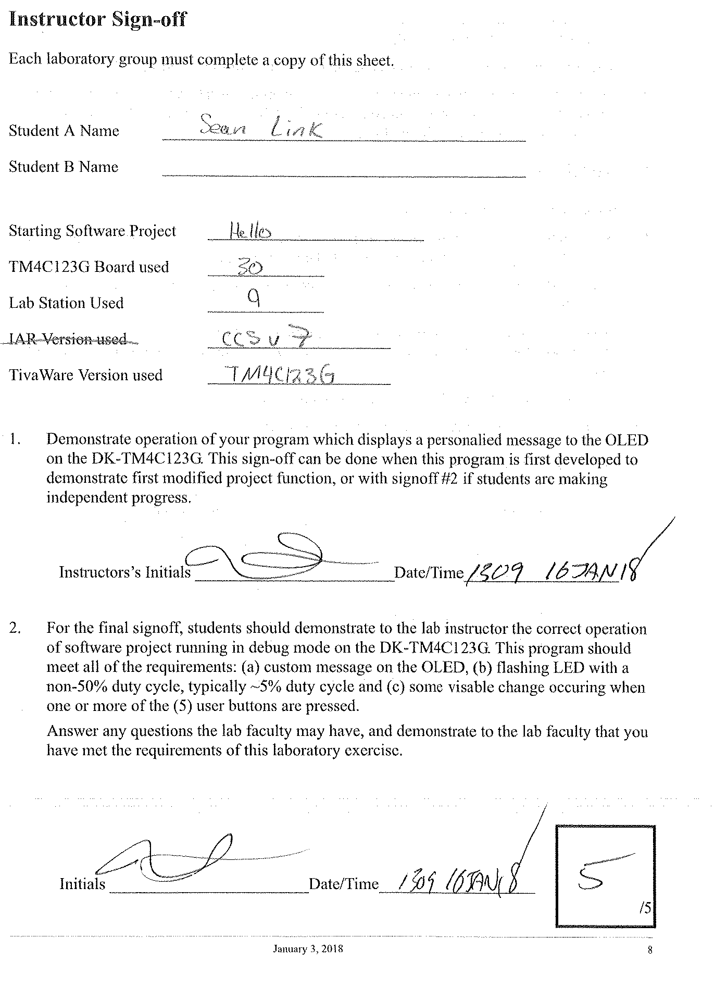

# Lab Number & Title

## Purpose and Objectives

2-5 sentences what is the point of the lab

## New Peripheral 1

We still need to talk about the what additional thoughts that you had.

High level overview. How does including this peripheral help achieve in the overall desired result? 2-3 Sentences.

~~~c
void myFakeFunction(int sumParameter1, char sumParameter2)
~~~

- Flag or bits set
  - One sentence saying why you set it to a particular flag

~~~c
void mySecondFakeFunction(char* youGetTheIdea)
~~~

- Flag or bits set
  - One sentence saying why you set it to a particular flag

### Encountered Issues 1

Any Issues encountered while configuring this peripheral and how they where addressed. 2-7 sentences.

## New Peripheral 2

High level overview. How does including this peripheral help achieve in the overall desired result? 2-3 Sentences.

~~~c
void myFakeFunction(int sumParameter1, char sumParameter2)
~~~

- Flag or bits set
  - One sentence saying why you set it to a particular flag

~~~c
void mySecondFakeFunction(char* youGetTheIdea)
~~~

- Flag or bits set
  - One sentence saying why you set it to a particular flag

### Encountered Issues 2

Any Issues encountered while configuring this peripheral and how they where addressed. 2-7 sentences.

## Relevant Images

Insert image here. Block diagram would be most appreciated. Describe what was inserted.

## Sign Off

